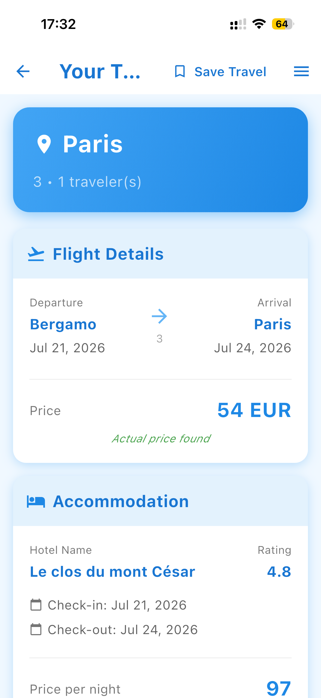
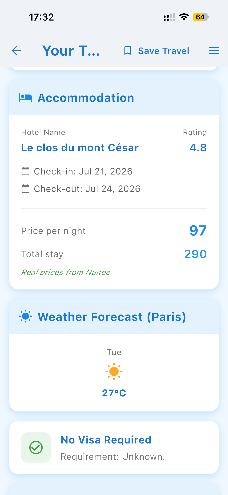
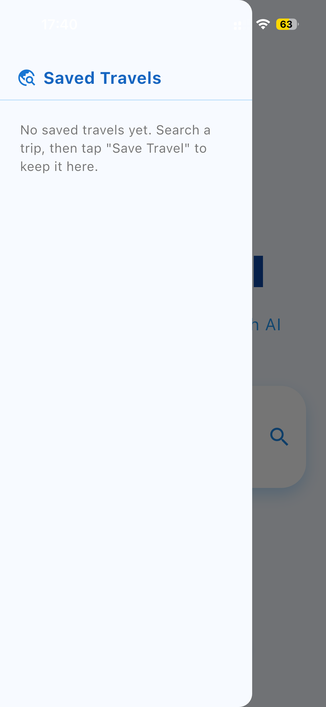

<p align="center">
  
</p>

<h1 align="center">TravelAI</h1>

<p align="center">
  <strong>✈️ AI-Powered Travel Planning, End-to-End 🗺️</strong>
</p>

<p align="center">
  Built with Flutter & Node.js • Powered by Google Gemini AI
</p>

---

TravelAI is a modern, AI-assisted trip-planning application built with **Flutter** and powered by a **Node.js/Express** backend utilizing the **Google Gemini API**. Users describe a trip in plain English — destination, dates, origin city — and TravelAI parses the request with Gemini, then assembles a complete itinerary by pulling real flights from **Duffel**, real hotel pricing from **Nuitee**, a live weather forecast, destination news, and a visa requirement check into a single, structured travel plan.

---

## 📱 UI Showcase & App Walkthrough

### 🧩 Core App Journey
| 1. Home Screen | 2. Natural Language Search | 3. Generating Plan |
| --- | --- | --- |
|  |  |  |
| Clean landing page with quick-start popular search suggestions. | Free-text search box accepts a full natural-language travel request. | Animated loading state while Gemini parses the query and the backend assembles the plan. |

### 🤖 AI-Generated Travel Plan
| 4. Flights & Hotel | 5. Weather & Visa | 6. Destination News |
| --- | --- | --- |
|  |  |  |
| Real flight pricing from Duffel paired with a scored hotel match from Nuitee. | Day-by-day weather forecast for the travel dates and an automated visa requirement check. | Live, relevant news headlines about the destination pulled in for extra trip context. |

### 💾 Saving & Managing Travels
| 7. Save a Travel | 8. Empty Sidebar | 9. Saved Travels List |
| --- | --- | --- |
|  |  |  |
| Able to save with one tap the generated plan locally so it can be revisited without another API call. | Friendly empty state guiding first-time users toward saving a trip. | Sliding drawer listing saved travels with quick reopen and delete actions. |

---

## 🚀 Core Features

* **Natural Language Trip Parsing:** Type a request like *"I want to visit Paris next Monday from Bergamo for 3 days"* and Gemini (`gemini-1.5-flash`-class model) extracts structured trip details — origin, destination, dates, and traveler count.
* **Real Flight Search:** Flight offers are resolved and priced live through the **Duffel API**, including place/IATA resolution for both departure and arrival cities.
* **Real Hotel Search & Scoring:** Hotel options are sourced from the **Nuitee API**, with results scored on a blend of guest rating and price to surface the best-value stay for the trip dates.
* **Weather Forecast:** A day-by-day forecast for the exact travel window is pulled from **WeatherAPI.com** and mapped to each day of the trip.
* **Destination News:** The latest relevant headlines about the destination are pulled in via **NewsAPI** for extra situational context.
* **Visa Requirement Check:** A guest-nationality-aware visa requirement lookup flags whether the traveler needs a visa for the destination.
* **Local Travel Persistence:** Saved travel plans are cached on-device with `shared_preferences`, so reopening a saved trip costs zero additional API calls.

---

## ⚙️ Engineering Architecture

### Frontend Technology Stack
* **Framework:** Flutter (Dart)
* **Networking:** `http` for calling the backend's `/api/generate-plan` endpoint
* **Local Storage:** `shared_preferences` for persisting saved travel plans as JSON
* **Structure:** `main.dart` (search entry point), `results_screen.dart` (itinerary display), `widgets/travel_sidebar.dart` (saved travels drawer), `services/travel_storage_service.dart` (local persistence layer)

### Backend Architecture Middleware
* **Runtime Platform:** Node.js (Express framework runtime)
* **AI Core Integration:** Google Generative AI SDK (`@google/generative-ai`) for parsing free-text travel queries into structured JSON
* **Flights:** `@duffel/api` for place resolution, offer search, and pricing
* **Hotels, Weather, News & Visa:** `axios`-based integrations against Nuitee, WeatherAPI.com, NewsAPI, and a visa-check endpoint
* **Testing:** `jest` and `supertest` cover the pure helper functions and the `/api/generate-plan` endpoint's validation and error paths

---

## 📦 Setup & Deployment

### 1. Project Prerequisites
* [Flutter SDK](https://docs.flutter.dev/get-started/install) installed.
* [Node.js](https://nodejs.org/) (v18+ recommended) installed.
* API keys for: [Google AI Studio](https://aistudio.google.com/) (Gemini), [Duffel](https://duffel.com/), Nuitee, [WeatherAPI.com](https://www.weatherapi.com/), and [NewsAPI](https://newsapi.org/).

### 2. Backend Server Setup
0. Navigate to the backend directory:
```bash
cd backend
```
1. Install the necessary NPM dependencies:
```bash
npm install
```
2. Set up your local environment file (`.env`):
```env
GEMINI_API_KEY=your_actual_gemini_api_key_here
DUFFEL_API_KEY=your_actual_duffel_api_key_here
NUITEE_API_KEY=your_actual_nuitee_api_key_here
WEATHER_API_KEY=your_actual_weatherapi_key_here
NEWS_API_KEY=your_actual_newsapi_key_here
```
3. Fire up your development server:
```bash
npm run dev
```
4. (Optional) Run the backend test suite:
```bash
npm test
```

### 3. Frontend Application Setup
0. Navigate to the frontend directory:
```bash
cd frontend
```
1. Validate your environment targets:
```bash
flutter doctor
```
2. Fetch your packages:
```bash
flutter pub get
```
3. Point the app at your backend (defaults to the deployed instance; override at build time):
```bash
flutter run --dart-define=API_BASE_URL=http://localhost:3000
```
4. (Optional) Run the frontend test suite:
```bash
flutter test
```
