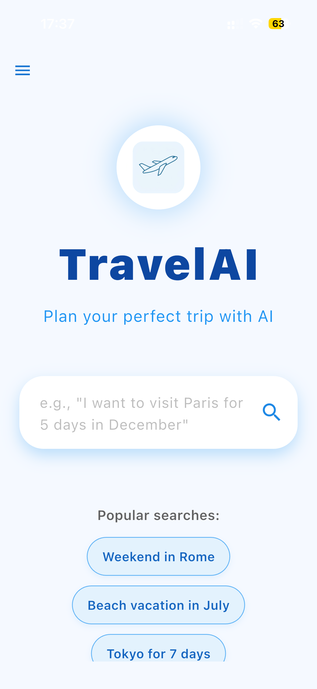
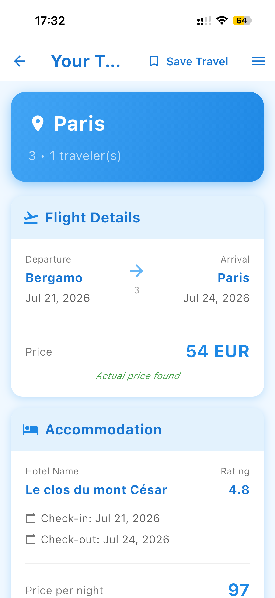
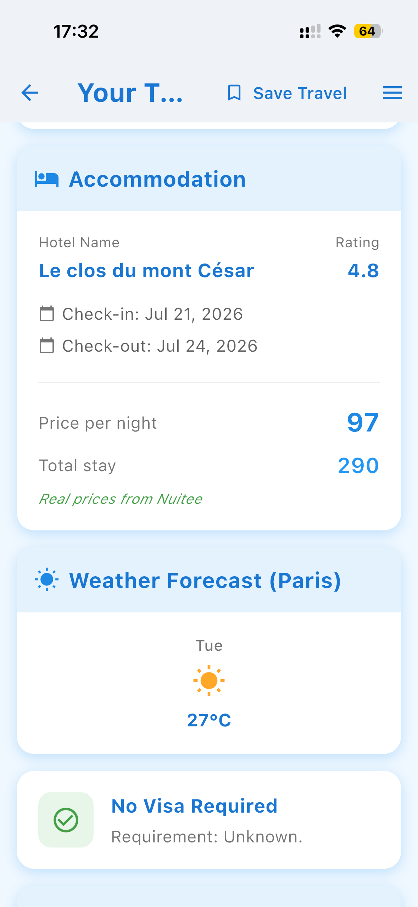
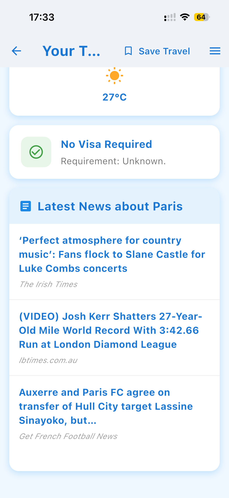
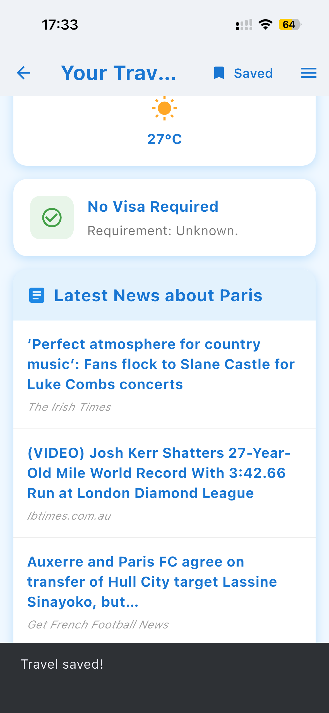
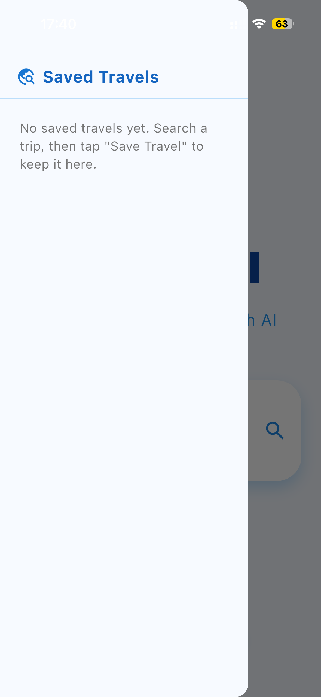

<p align="center">
  
</p>

<h1 align="center">TravelAI</h1>

<p align="center">
  <strong>✈️ AI-Powered Travel Planning, End-to-End 🗺️</strong>
</p>

<p align="center">
  Built with Flutter & Node.js • Powered by Google Gemini AI
</p>

---

TravelAI is a modern, AI-assisted trip-planning application built with **Flutter** and powered by a **Node.js/Express** backend utilizing the **Google Gemini API**. Users describe a trip in any language — destination, dates, origin city — and TravelAI parses the request with Gemini, then assembles a complete itinerary by pulling real flights from **Duffel**, real hotel pricing from **Nuitee**, a live weather forecast, destination news, and a visa requirement check into a single, structured travel plan.

---

## 📱 UI Showcase & App Walkthrough

### 🧩 Core App Journey
| 1. Home Screen | 2. Natural Language Search | 3. Generating Plan |
| --- | --- | --- |
|  |  |  |
| Clean landing page with quick-start popular search suggestions. | Free-text search box accepts a full natural-language travel request. | Animated loading state while Gemini parses the query and the backend assembles the plan. |

### 🤖 AI-Generated Travel Plan
| 4. Flights & Hotel | 5. Weather & Visa | 6. Destination News |
| --- | --- | --- |
|  |  |  |
| Real flight pricing from Duffel paired with a scored hotel match from Nuitee. | Day-by-day weather forecast for the travel dates and an automated visa requirement check. | Live, relevant news headlines about the destination pulled in for extra trip context. |

### 💾 Saving & Managing Travels
| 7. Save a Travel | 8. Empty Sidebar | 9. Saved Travels List |
| --- | --- | --- |
|  |  |  |
| Able to save with one tap the generated plan locally so it can be revisited without another API call. | Friendly empty state guiding first-time users toward saving a trip. | Sliding drawer listing saved travels with quick reopen and delete actions. |

---

## 🚀 Core Features

* **Natural Language Trip Parsing:** Type a request like *"I want to visit Paris next Monday from Bergamo for 3 days"* and Gemini (`gemini-1.5-flash`-class model) extracts structured trip details — origin, destination, dates, and traveler count.
* **Real Flight Search:** Flight offers are resolved and priced live through the **Duffel API**, including place/IATA resolution for both departure and arrival cities.
* **Real Hotel Search & Scoring:** Hotel options are sourced from the **Nuitee API**, with results scored on a blend of guest rating and price to surface the best-value stay for the trip dates.
* **Weather Forecast:** A day-by-day forecast for the exact travel window is pulled from **WeatherAPI.com** and mapped to each day of the trip.
* **Destination News:** The latest relevant headlines about the destination are pulled in via **NewsAPI** for extra situational context.
* **Visa Requirement Check:** A guest-nationality-aware visa requirement lookup flags whether the traveler needs a visa for the destination.
* **Local Travel Persistence:** Saved travel plans are cached on-device with `shared_preferences`, so reopening a saved trip costs zero additional API calls.
* **Cloud Accounts & Sync (backend, in progress):** A Supabase-backed `/api/auth` and `/api/travels` API now exists for real user accounts and cross-device saved-travel sync — see [Cloud Backend & Accounts](#-cloud-backend--accounts) below. The Flutter app doesn't call it yet; `shared_preferences` remains the active storage path until that wiring lands.

---

## ⚙️ Engineering Architecture

### Frontend Technology Stack
* **Framework:** Flutter (Dart)
* **Networking:** `http` for calling the backend's `/api/generate-plan` endpoint
* **Local Storage:** `shared_preferences` for persisting saved travel plans as JSON
* **Structure:** `main.dart` (search entry point), `results_screen.dart` (itinerary display), `widgets/travel_sidebar.dart` (saved travels drawer), `services/travel_storage_service.dart` (local persistence layer)

### Backend Architecture Middleware
* **Runtime Platform:** Node.js (Express framework runtime)
* **AI Core Integration:** Google Generative AI SDK (`@google/generative-ai`) for parsing free-text travel queries into structured JSON
* **Flights:** `@duffel/api` for place resolution, offer search, and pricing
* **Hotels, Weather, News & Visa:** `axios`-based integrations against Nuitee, WeatherAPI.com, NewsAPI, and a visa-check endpoint
* **Accounts & Cloud Sync:** `@supabase/supabase-js` against a Supabase Postgres project — see [Cloud Backend & Accounts](#-cloud-backend--accounts)
* **Testing:** `jest` and `supertest` cover the pure helper functions and the `/api/generate-plan`, `/api/auth`, `/api/travels`, and `/api/profile` endpoints' validation and error paths

---

## ☁️ Cloud Backend & Accounts

The backend now has a Supabase-backed layer for real user accounts and cross-device saved-travel sync, alongside the original stateless `/api/generate-plan` flow. Full design rationale lives in [`docs/supabase-schema-design.md`](docs/supabase-schema-design.md); the short version:

* **Accounts** ride on Supabase Auth (`auth.users`) rather than a hand-rolled users table, extended by a `public.profiles` row (display name, home city) per user.
* **Sessions** are the backend's own, not Supabase's: a 15-minute JWT access token plus an opaque refresh token, hashed (SHA-256) at rest in `public.refresh_tokens` and **rotated on every use** — each refresh token is single-use, and replaying an already-rotated one revokes every session for that account (theft/reuse detection).
* **Saved travels** move from on-device `shared_preferences` to `public.saved_travels`, scoped per user with Postgres row-level security as defense-in-depth (the trusted Node backend holds the Supabase service-role key and is the only caller).
* **The "Departing from home?" toggle** (planned frontend UX) deliberately never reaches the Gemini prompt — `profiles.home_city` is only applied as a deterministic fallback *after* parsing, and only when Gemini itself left the departure city unspecified, so it can never collide with what the user actually typed.

### API surface

| Endpoint | Auth | Purpose |
|---|---|---|
| `POST /api/auth/signup` | — | Create an account (email/password), auto-logs in |
| `POST /api/auth/login` | — | Exchange email/password for an access/refresh token pair |
| `POST /api/auth/refresh` | — | Exchange a still-valid refresh token for a new (rotated) pair |
| `POST /api/auth/logout` | — | Revoke a refresh token |
| `GET /api/profile` | Bearer access token | Read the caller's display name / home city |
| `PATCH /api/profile` | Bearer access token | Update display name / home city |
| `GET /api/travels` | Bearer access token | List the caller's saved travels, most recent first |
| `POST /api/travels` | Bearer access token | Save a generated plan (body: `{ travelPlan }`) |
| `DELETE /api/travels/:id` | Bearer access token | Delete a saved travel (404 if not owned) |

`/api/generate-plan` itself stays open to logged-out use; it optionally reads the caller's identity (if a valid access token is sent) purely to apply the home-city fallback above — an expired/missing token there never blocks plan generation.

A `401` from any authenticated endpoint means the access token is missing or expired — refresh and retry once; a `401` from `/api/auth/refresh` itself means the refresh token is dead too and the user needs to log in again.

### Database setup

1. Create a project at [supabase.com](https://supabase.com/).
2. In the SQL Editor, run [`backend/supabase/migrations/0001_init.sql`](backend/supabase/migrations/0001_init.sql) once — it creates `profiles`, `saved_travels`, `refresh_tokens`, their indexes, RLS policies, and the auto-profile-creation trigger.
3. Grab **Project URL**, **anon public key**, and **service_role key** from Project Settings → API, and add them to your `.env` (see below).

---

## 📦 Setup & Deployment

### 1. Project Prerequisites
* [Flutter SDK](https://docs.flutter.dev/get-started/install) installed.
* [Node.js](https://nodejs.org/) (v18+ recommended) installed.
* API keys for: [Google AI Studio](https://aistudio.google.com/) (Gemini), [Duffel](https://duffel.com/), Nuitee, [WeatherAPI.com](https://www.weatherapi.com/), and [NewsAPI](https://newsapi.org/).
* A [Supabase](https://supabase.com/) project (see [Database setup](#database-setup) above) for accounts and saved-travel sync.

### 2. Backend Server Setup
0. Navigate to the backend directory:
```bash
cd backend
```
1. Install the necessary NPM dependencies:
```bash
npm install
```
2. Set up your local environment file (`.env`):
```env
GEMINI_API_KEY=your_actual_gemini_api_key_here
DUFFEL_API_KEY=your_actual_duffel_api_key_here
NUITEE_API_KEY=your_actual_nuitee_api_key_here
WEATHER_API_KEY=your_actual_weatherapi_key_here
NEWS_API_KEY=your_actual_newsapi_key_here

# Supabase (see "Cloud Backend & Accounts" above)
SUPABASE_URL=https://your-project.supabase.co
SUPABASE_ANON_KEY=your_supabase_anon_public_key_here
SUPABASE_SERVICE_ROLE_KEY=your_supabase_service_role_key_here

# Signs/verifies the backend's own 15-minute access tokens — any long random string
JWT_SECRET=a_long_random_secret_used_to_sign_access_tokens
```
3. Fire up your development server:
```bash
npm run dev
```
4. (Optional) Run the backend test suite:
```bash
npm test
```

### 3. Frontend Application Setup
0. Navigate to the frontend directory:
```bash
cd frontend
```
1. Validate your environment targets:
```bash
flutter doctor
```
2. Fetch your packages:
```bash
flutter pub get
```
3. Point the app at your backend (defaults to the deployed instance; override at build time):
```bash
flutter run --dart-define=API_BASE_URL=http://localhost:3000
```
4. (Optional) Run the frontend test suite:
```bash
flutter test
```
